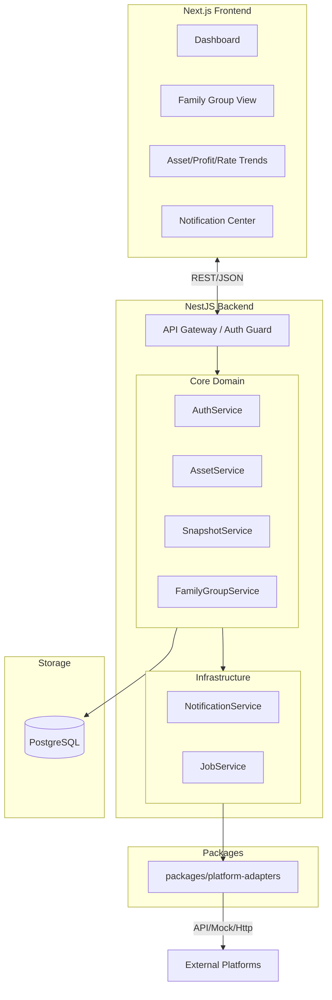

# 资产管理系统 (Cola Finance) 技术架构与详细设计

| 文档版本 | 修改日期 | 修改人 | 备注 |
| :--- | :--- | :--- | :--- |
| v2.5 | 2025-12-19 | AI Assistant | 新增 PWA 技术选型与 manifest 配置 |
| v2.4 | 2025-12-19 | AI Assistant | 新增家庭组 (Family Group)、消息通知与注册流程设计 |
| v2.3 | 2025-12-19 | AI Assistant | 重构爬虫模块为适配器模式 (Platform Adapters)，增加 Mock 平台设计 |
| v2.2 | 2025-12-06 | AI Assistant | 新增多用户支持、独立爬虫包、每日快照覆盖策略 |
| v2.1 | 2025-12-06 | AI Assistant | 基于 PRD v2.0 细化数据模型、接口定义与核心算法 |

## 1. 架构总览 (Architecture Overview)

### 1.1 设计原则
- **Local-First & Privacy**: 数据完全私有化，数据库 (SQLite/PostgreSQL) 部署在本地。
- **Multi-User Isolation**: 支持家庭多用户，数据逻辑隔离 (Row-Level Security 思想)。
- **Adapter-Based**: 数据获取逻辑封装为独立适配器包，与核心业务解耦，支持 API/Mock/Crawler 多种模式。
- **Snapshot Consistency**: 每日保留一份最新快照，支持历史走势回溯。
- **Collaborative**: 支持家庭组 (Family Group) 数据聚合与共享。

### 1.2 技术栈
- **Frontend**: `Next.js 14+`, `Recharts` (走势图), `Zustand`.
- **PWA**: `next-pwa` (Plugin), `manifest.json` (Web App Manifest).
- **Backend**: `NestJS`, `Prisma ORM`.
- **Monorepo**:
  - `apps/web`: 前端应用
  - `apps/api`: 后端 API 服务
  - `packages/platform-adapters`: 平台数据适配器模块
  - `packages/db`: 数据库 Schema 与 Client

### 1.3 系统拓扑



---

## 2. 详细数据模型 (Data Model)

### 2.1 用户与账户

```prisma
// 用户
model User {
  id          String    @id @default(uuid())
  username    String    @unique
  password    String    // bcrypt hash
  email       String?   // optional for notification
  timezone    String    @default("Asia/Shanghai")
  createdAt   DateTime  @default(now())

  accounts    Account[]
  snapshots   Snapshot[]
  memberships GroupMember[]
  notifications Notification[]
}

// 账户 (Account) - 存储各平台凭证
model Account {
  id          String   @id @default(uuid())
  userId      String   // 关联用户
  platform    PlatformType
  name        String
  credentials String?  // 加密存储的 API Key / Token
  status      String

  user        User     @relation(fields: [userId], references: [id])
  assets      AssetHolding[]
}

enum PlatformType {
  EASTMONEY // 东方财富
  TIANTIAN  // 天天基金
  XUEQIU    // 雪球
  IBKR      // 盈透证券
  SCHWAB    // 嘉信理财 [NEW]
  MOCK      // 模拟
  OTHER
}
```

### 2.2 家庭组与协作 (Family Group)

```prisma
// 家庭组/投资组
model FamilyGroup {
  id          String    @id @default(uuid())
  name        String
  creatorId   String
  createdAt   DateTime  @default(now())

  members     GroupMember[]
}

// 组成员关联
model GroupMember {
  id          String    @id @default(uuid())
  groupId     String
  userId      String
  role        GroupRole @default(MEMBER) // OWNER, MEMBER
  joinedAt    DateTime  @default(now())

  group       FamilyGroup @relation(fields: [groupId], references: [id])
  user        User        @relation(fields: [userId], references: [id])

  @@unique([groupId, userId])
}

enum GroupRole {
  OWNER
  MEMBER
}
```

### 2.3 消息通知 (Notification)

```prisma
model Notification {
  id          String    @id @default(uuid())
  userId      String    // 接收人
  type        NotifyType
  title       String
  content     String
  payload     Json?     // 携带额外数据 (如 groupId, inviterId)
  isRead      Boolean   @default(false)
  createdAt   DateTime  @default(now())

  user        User      @relation(fields: [userId], references: [id])
}

enum NotifyType {
  INVITATION  // 邀请加入
  SYSTEM      // 系统通知
  ALERT       // 资产预警
}
```

### 2.4 每日快照 (Daily Snapshot)

```prisma
// 全局快照 (Snapshot)
model Snapshot {
  id          String   @id @default(uuid())
  userId      String
  
  // 业务日期: YYYY-MM-DD
  date        String   
  timestamp   DateTime @default(now())

  totalValue  Decimal  
  dayProfit   Decimal  
  totalProfit Decimal  
  
  status      String   
  
  holdings    AssetHolding[]
  user        User     @relation(fields: [userId], references: [id])

  @@unique([userId, date])
  @@index([date])
}

// 持仓快照
model AssetHolding {
  id            String   @id @default(uuid())
  snapshotId    String
  accountId     String
  
  symbol        String
  quantity      Decimal
  price         Decimal
  costPrice     Decimal
  marketValue   Decimal
  dayProfit     Decimal
  
  snapshot      Snapshot @relation(fields: [snapshotId], references: [id], onDelete: Cascade)
  account       Account  @relation(fields: [accountId], references: [id])
}
```

---

## 3. 核心模块与算法 (Core Logic)

### 3.1 平台适配器封装 (`packages/platform-adapters`)

为了支持未来方便地扩展更多交易平台（如嘉信理财、富途牛牛等），系统采用**适配器模式 (Adapter Pattern)**。

#### 3.1.1 统一接口定义
所有适配器必须实现 `IPlatformAdapter` 接口，确保上层业务对具体平台无感知。

```typescript
export interface FetchedAsset {
  symbol: string;      // 资产代码 (e.g., "AAPL", "000001")
  name: string;        // 资产名称
  quantity: number;    // 持有数量
  price: number;       // 当前单价
  costPrice: number;   // 成本单价
  currency: string;    // 原始币种 (USD, CNY, HKD)
  marketValue: number; // 市值
}

export interface IPlatformAdapter {
  platform: PlatformType; // 平台标识
  name: string;           // 平台显示名称

  // 核心方法：获取最新持仓
  fetchAssets(credentials: Record<string, any>): Promise<FetchedAsset[]>;
  
  // 可选方法：校验凭证有效性
  validateCredentials?(credentials: Record<string, any>): Promise<boolean>;
}
```

#### 3.1.2 适配器注册与工厂
使用工厂模式管理适配器，新增平台只需注册一个新的 Class，无需修改核心调用逻辑。

```typescript
export class AdapterFactory {
  private static adapters = new Map<PlatformType, IPlatformAdapter>();

  static register(adapter: IPlatformAdapter) {
    this.adapters.set(adapter.platform, adapter);
  }

  static getAdapter(type: PlatformType): IPlatformAdapter {
    const adapter = this.adapters.get(type);
    if (!adapter) throw new Error(`Adapter for ${type} not found`);
    return adapter;
  }
}

// 注册示例 (在应用启动时执行)
AdapterFactory.register(new EastMoneyAdapter());
AdapterFactory.register(new IBKRAdapter());
AdapterFactory.register(new SchwabAdapter()); // 新增平台只需在此添加
```

### 3.2 每日快照覆盖策略 (SnapshotService)

系统强制执行“每日一快照”原则，确保历史趋势图的数据点均匀且唯一。

#### 3.2.1 覆盖逻辑 (Upsert Logic)
利用数据库的 Unique Constraint (`[userId, date]`) 和 Prisma 的事务机制。

```typescript
async function saveDailySnapshot(userId: string, data: FetchedAsset[]) {
  const user = await db.user.findUnique({ where: { id: userId } });
  // 根据用户时区确定“今天”的日期字符串 (e.g., "2025-12-20")
  const today = format(new Date(), 'yyyy-MM-dd', { timeZone: user.timezone });

  await db.$transaction(async (tx) => {
    // 1. 查找今日是否已存在快照
    const existing = await tx.snapshot.findUnique({
      where: { userId_date: { userId, date: today } }
    });

    if (existing) {
      // 2. 存在则清理旧持仓数据
      await tx.assetHolding.deleteMany({ where: { snapshotId: existing.id } });
      
      // 3. 更新快照元数据
      await tx.snapshot.update({
        where: { id: existing.id },
        data: {
          timestamp: new Date(),
          totalValue: sum(data.marketValue),
          holdings: { create: data.map(toHoldingModel) }
        }
      });
    } else {
      // 4. 不存在则新建
      await tx.snapshot.create({
        data: {
          userId,
          date: today,
          totalValue: sum(data.marketValue),
          holdings: { create: data.map(toHoldingModel) }
        }
      });
    }
  });
}
```

### 3.3 家庭组数据聚合 (FamilyGroupService)

**聚合逻辑**:
当请求家庭组数据看板时，不实时拉取各成员的最新数据，而是**基于已生成的每日快照 (`Snapshot`) 进行聚合**。

1.  **获取成员**: 查询 `GroupMember` 获取所有 `userId`。
2.  **获取快照**: 查询所有成员在指定日期范围内的 `Snapshot`。
3.  **计算聚合值**:
    - `GroupTotalAsset(date) = Sum(Member_i.Snapshot(date).totalValue)`
    - `GroupDayProfit(date) = Sum(Member_i.Snapshot(date).dayProfit)`
    - `GroupTotalProfit(date) = Sum(Member_i.Snapshot(date).totalProfit)`
4.  **聚合收益率**:
    - 使用聚合后的每日总资产与收益流重新计算 TWR，确保数学意义正确。

---

## 4. 接口设计 (API Specification)

### 4.1 用户与授权 (Auth)
- `POST /auth/register`: 注册 (username, password)
- `POST /auth/login`: 登录 -> 返回 JWT

### 4.2 家庭组管理 (Group)
- `POST /groups`: 创建组
- `POST /groups/:id/invite`: 邀请用户 (param: username) -> 生成 `Notification`
- `GET /groups/:id/members`: 成员列表
- `GET /groups/:id/dashboard`: 聚合看板数据 (Assets, Profits, Trends)

### 4.3 消息中心 (Notification)
- `GET /notifications`: 列表
- `POST /notifications/:id/read`: 标为已读
- `POST /notifications/:id/accept`: 接受邀请 -> 插入 `GroupMember`

### 4.4 历史走势 (Trend)
- `GET /api/v1/history/trend?range=...`
  - **Params**:
    - `range`: `1M` | `3M` | `6M` | `1Y` | `2Y` | `3Y` | `5Y` | `10Y` | `ALL`
- `GET /api/v1/groups/:id/trend?range=...`: (家庭组聚合，参数同上)
- **Frontend Strategy**:
  - 使用 `Zustand` + `persist middleware` 或 `localStorage` 存储用户选择的 `trendRange`，作为默认值。

---

## 5. 工程结构更新

```text
cola-finance/
├── apps/
│   ├── web/
│   │   ├── public/
│   │   │   ├── manifest.json    # [NEW] PWA Manifest
│   │   │   └── icons/           # [NEW] PWA Icons
│   │   ├── next.config.js       # [UPD] next-pwa config
│   │   └── ...
│   └── api/
│       ├── src/
│       │   ├── auth/            # [NEW]
│       │   ├── family-group/    # [NEW]
│       │   ├── notification/    # [NEW]
│       │   └── ...
├── packages/
│   ├── platform-adapters/
│   ├── db/
│   └── shared/
└── ...
```
