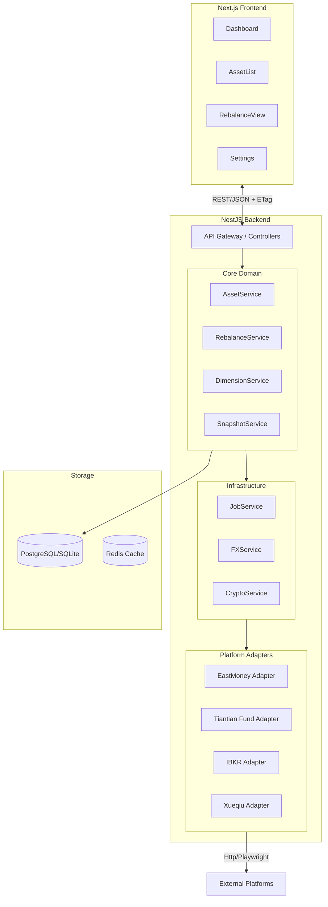

# 资产管理系统 (Cola Finance) 技术架构与详细设计

| 文档版本 | 修改日期 | 修改人 | 备注 |
| :--- | :--- | :--- | :--- |
| v2.1 | 2025-12-06 | AI Assistant | 基于 PRD v2.0 细化数据模型、接口定义与核心算法 |

## 1. 架构总览 (Architecture Overview)

### 1.1 设计原则
- **Local-First & Privacy**: 数据完全私有化，数据库 (SQLite/PostgreSQL) 部署在本地，凭证 (Token/Cookies) 本地加密存储。
- **Adapter-Based**: 核心业务逻辑与数据来源解耦，通过适配器模式接入不同券商/平台。
- **Snapshot Consistency**: 采用“快照 (Snapshot)”机制管理数据版本，确保前端看到的总是同一时刻的完整资产视图。
- **Unified Data Model**: 无论来源是 A 股、美股还是基金，最终都清洗为统一的 `AssetHolding` 模型。

### 1.2 技术栈
- **Frontend**: `Next.js 14+` (App Router), `React`, `Tailwind CSS`, `Recharts/ECharts` (图表), `Zustand` (状态管理).
- **Backend**: `NestJS`, `Prisma ORM`, `RxJS`.
- **Database**: `PostgreSQL` (推荐) 或 `SQLite` (轻量级文件存储).
- **Crawler**: `Playwright` (Headless Browser for complex auth/scraping), `Axios` (Official API).
- **Job Queue**: `BullMQ` (Redis) 或 `NestJS Schedule` (简单场景).

### 1.3 系统拓扑



---

## 2. 详细数据模型 (Data Model)

基于 Prisma Schema 描述。

### 2.1 核心资产模型

```prisma
// 平台枚举
enum PlatformType {
  EAST_MONEY  // 东方财富
  TIANTIAN    // 天天基金
  XUEQIU      // 雪球
  IBKR        // 盈透证券
  MANUAL      // 手动录入
}

// 基础货币
enum Currency {
  CNY
  USD
  HKD
  // ... others
}

// 账户 (Account)
model Account {
  id          String   @id @default(uuid())
  platform    PlatformType
  name        String   // 账户名称，如 "美股账户-IBKR"
  credentials String?  // 加密后的凭证 (JSON string)
  status      String   // ACTIVE, ERROR, EXPIRED
  lastSyncAt  DateTime?
  
  assets      AssetHolding[]
  snapshots   Snapshot[]
}

// 持仓快照 (AssetHolding) - 核心表
// 每次同步生成新的 Snapshot，包含当次所有 Account 的 Holdings
model AssetHolding {
  id            String   @id @default(uuid())
  snapshotId    String
  accountId     String
  
  // 原始资产信息
  symbol        String   // 代码: "sh600519", "AAPL"
  name          String   // 名称: "贵州茅台", "Apple Inc."
  assetType     String   // 原始类型: "Stock", "Fund", "Bond"
  
  // 核心数值 (Decimal ensure precision)
  quantity      Decimal  // 持仓数量/份额
  price         Decimal  // 最新单价/净值
  costPrice     Decimal  // 成本价 (平台获取或手动覆盖)
  currency      Currency // 原始币种
  
  // 计算数值 (存库以固化快照)
  marketValue   Decimal  // quantity * price
  dayProfit     Decimal  // 当日盈亏
  totalProfit   Decimal  // 持仓盈亏: (price - costPrice) * quantity
  
  // 关联
  snapshot      Snapshot @relation(fields: [snapshotId], references: [id])
  account       Account  @relation(fields: [accountId], references: [id])

  @@index([snapshotId])
  @@index([symbol])
}

// 全局快照 (Snapshot)
model Snapshot {
  id          String   @id @default(uuid())
  createdAt   DateTime @default(now())
  hash        String   // 内容哈希，用于 ETag
  totalValue  Decimal  // 总资产折合 (Base Currency)
  status      String   // COMPLETED, PARTIAL (部分失败)
  
  holdings    AssetHolding[]
}
```

### 2.2 维度与配置

```prisma
// 维度 (Dimension) - 如 "资产属性", "市场地域"
model Dimension {
  id          String   @id @default(uuid())
  name        String   // "Asset Class", "Region"
  isSystem    Boolean  @default(false) // 是否系统预设
  
  classifications Classification[]
}

// 分类 (Classification) - 如 "权益类", "美股"
model Classification {
  id          String   @id @default(uuid())
  dimensionId String
  name        String   // "Equity", "US Market"
  
  // 再平衡配置
  targetWeight Decimal // 目标占比 (0.0 - 1.0)
  tolerance    Decimal // 容忍度 Band (e.g. 0.05 for 5%)
  
  dimension   Dimension @relation(fields: [dimensionId], references: [id])
  rules       ClassificationRule[]
}

// 自动分类规则 (ClassificationRule)
model ClassificationRule {
  id               String @id @default(uuid())
  classificationId String
  priority         Int    @default(0)
  
  // 匹配条件
  matchSymbol      String? // 正则或精确匹配
  matchName        String?
  matchType        String?
  
  classification   Classification @relation(fields: [classificationId], references: [id])
}
```

---

## 3. 核心模块与算法 (Core Logic)

### 3.1 统一口径与计算 (AssetService)

所有从 Adapter 进来的数据必须经过 `Pipeline` 清洗：

1.  **Normalize**: 映射字段到 `AssetHolding` 标准字段。
2.  **Fill Gaps**:
    *   若 `dayProfit` 缺失 -> 计算 `(currentPrice - prevClose) * quantity`。
    *   若 `costPrice` 缺失 -> 标记为 `0` 或尝试读取用户手动补录配置。
3.  **FX Conversion**:
    *   调用 `FXService` 获取 `AssetCurrency -> SystemCurrency` 汇率。
    *   计算 `displayValue` (展示市值)。
4.  **Snapshot**:
    *   生成 `Snapshot` 记录，计算该次快照的 Hash (e.g., `sha256(JSON.stringify(sortedHoldings))`)。

### 3.2 再平衡算法 (RebalanceService)

**输入**:
- Snapshot (包含当前所有持仓)
- Dimension (选定的维度，如"资产属性")
- TotalAssetValue (当前总资产折算值)

**逻辑**:
```typescript
function generateAdvice(snapshot, dimension) {
  const advices = [];
  const totalValue = snapshot.totalValue; // e.g. 1,000,000 CNY
  
  // 1. 聚合当前持仓到分类
  const currentAllocations = groupByClassification(snapshot.holdings, dimension);
  
  for (const cls of dimension.classifications) {
    const currentVal = currentAllocations[cls.id] || 0;
    const currentWt = currentVal / totalValue;
    const targetWt = cls.targetWeight;
    const band = cls.tolerance; // e.g. 0.05
    
    // 2. Band Check logic
    const deviation = currentWt - targetWt;
    
    if (Math.abs(deviation) <= band) {
      continue; // 在容忍范围内，不做操作
    }
    
    // 3. 计算建议金额
    // 策略：回归到目标占比 (Revert to Target)
    const targetVal = totalValue * targetWt;
    const diffVal = targetVal - currentVal;
    
    advices.push({
      classification: cls.name,
      action: diffVal > 0 ? 'BUY' : 'SELL',
      amount: Math.abs(diffVal),
      reason: `Deviation ${(deviation * 100).toFixed(2)}% exceeds band ${(band * 100).toFixed(2)}%`
    });
  }
  
  return advices;
}
```

### 3.3 适配器接口 (Adapter Interface)

所有平台插件需实现以下接口：

```typescript
interface IPlatformAdapter {
  // 平台元数据
  readonly id: PlatformType;
  readonly name: string;
  
  // 核心抓取方法
  fetchAssets(credentials: string): Promise<RawAsset[]>;
  
  // 验证凭证有效性
  validateCredentials(credentials: string): Promise<boolean>;
}
```

---

## 4. 接口设计 (API Specification)

### 4.1 资产概览 (Overview)
- **Endpoint**: `GET /api/v1/assets/overview`
- **Headers**: `If-None-Match: "sha256-hash..."`
- **Response**:
  - `200 OK`:
    ```json
    {
      "data": {
        "totalValue": 1250000.00,
        "totalDayProfit": 5200.00,
        "totalProfit": 150000.00,
        "currency": "CNY",
        "updatedAt": "2025-12-06T10:00:00Z",
        "holdings": [ ...AssetHoldingList... ]
      },
      "meta": {
        "snapshotId": "uuid...",
        "warnings": ["IBKR data is 2 hours old"]
      }
    }
    ```
  - `304 Not Modified`: (当 ETag 匹配时)

### 4.2 再平衡建议 (Rebalance)
- **Endpoint**: `POST /api/v1/rebalance/advise`
- **Body**:
  ```json
  {
    "dimensionId": "dim-asset-class-uuid",
    "ignoreSmallDiff": true // 可选，忽略微小差异
  }
  ```
- **Response**:
  ```json
  {
    "totalAssets": 1000000,
    "plan": [
      {
        "classification": "Stock",
        "currentWeight": 0.65,
        "targetWeight": 0.50,
        "action": "SELL",
        "amount": 150000,
        "message": "Reduce exposure to Equity"
      },
      {
        "classification": "Bond",
        "currentWeight": 0.20,
        "targetWeight": 0.40,
        "action": "BUY",
        "amount": 200000,
        "message": "Increase Fixed Income"
      }
    ]
  }
  ```

---

## 5. 工程结构 (Project Structure)

采用 Monorepo 结构以便于前后端类型共享。

```text
cola-finance/
├── apps/
│   ├── web/                 # Next.js Frontend
│   │   ├── app/             # App Router Pages
│   │   ├── components/      # UI Components
│   │   └── lib/             # Frontend Utils
│   │
│   └── api/                 # NestJS Backend
│       ├── src/
│       │   ├── modules/
│       │   │   ├── asset/   # Asset Module
│       │   │   ├── job/     # Job/Scheduler Module
│       │   │   └── ...
│       │   ├── adapters/    # Platform Adapters (EastMoney, IBKR...)
│       │   └── common/      # Shared Utils
│
├── packages/
│   ├── shared/              # Shared Types/Interfaces (DTOs)
│   └── db/                  # Prisma Schema & Client
│
├── docker-compose.yml       # DB & Redis setup
└── README.md
```

## 6. 安全与部署 (Security & Deployment)

1.  **凭证存储**:
    - 开发环境: `.env` 或本地 SQLite 加密字段。
    - 生产环境: 使用 AES-256-GCM 加密存储在数据库中的 `credentials` 字段，密钥由用户在启动时输入或环境变量注入 (`APP_SECRET`)。
2.  **网络隔离**:
    - 后端服务仅监听 `localhost` (默认)，通过 Nginx 反代或 Next.js Rewrite 暴露。
    - 数据库端口不直接对外暴露。

## 7. 开发计划 (Roadmap)

请参考 PRD 的 Milestones 章节。M1 阶段优先完成 `apps/api` 的 `AssetService` 与 `EastMoneyAdapter`，以及 `apps/web` 的基础看板。
