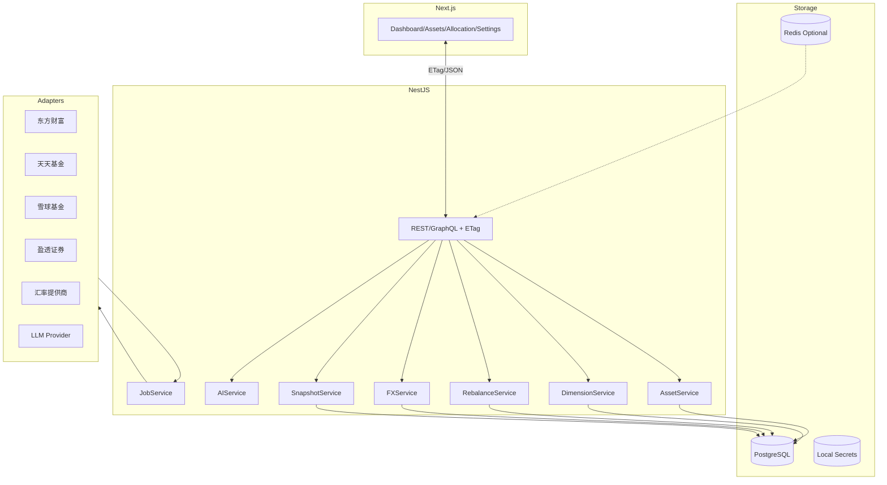

# 资产管理系统 (Cola Finance) 设计文档

| 文档版本 | 修改日期 | 修改人 | 备注 |
| :--- | :--- | :--- | :--- |
| v2.0 | 2025-12-05 | AI Assistant | 基于 `doc/prd-new.md` 设计落地方案 |

## 1. 架构目标与原则
- 单用户、本地优先、隐私安全，围绕“当前快照”构建稳定可靠的数据面。
- 模块化与适配器模式：平台、LLM、汇率源、数据库均可替换，低耦合。
- 一致口径与可观测：统一数据清洗与计算规则；完善日志、指标与健康检查。
- 简洁交付与可扩展：首期聚焦 Must 功能，保留扩展点。

## 2. 技术栈与系统拓扑
- 前端：`Next.js` + `TypeScript`，图表库（ECharts 或 Recharts），SSR/ISR。
- 后端：`NestJS` + `TypeScript`，`Prisma` 访问数据库。
- 数据库：PostgreSQL（可替换为 MySQL/SQLite），缓存：Redis（可选）。
- 任务调度：NestJS `@Cron` 或 `BullMQ`（Redis）。
- 抓取：Playwright（兜底），优先官方/非公开 API。
- AI：适配器层（可选），支持本地或私有云模型。

## 3. 模块职责与接口
- `AssetService`
  - 负责：持仓读取与统一口径计算（市值、收益、折算），生成概览与明细。
  - 接口：`getOverview(etag?)`、`listAssets(filters)`、`compute(snapshotId)`。
- `DimensionService`
  - 负责：维度与分类管理，预设映射、手动覆盖、AI 分类写入。
  - 接口：`listDimensions()`、`upsertClassification()`、`applyAutoClassification()`。
- `RebalanceService`
  - 负责：偏离计算、Band 容忍、建议生成（方向、金额/比例、单位约束）。
  - 接口：`getDeviation(dimensionId)`、`advise(dimensionId, bands, constraints)`。
- `FXService`
  - 负责：汇率拉取与缓存、三角换汇、精度与四舍五入策略。
  - 接口：`getRate(base, quote)`、`convert(amount, base, quote)`。
- `SnapshotService`
  - 负责：快照生成、ETag 哈希、版本管理与部分过期标注。
  - 接口：`create()`、`latest()`、`hash(snapshotId)`。
- `JobService`
  - 负责：平台抓取/API 拉取、失败重试（指数退避）、熔断与限速。
  - 接口：`runAll()`、`run(platformId)`、`status()`。
- `AIService`（可选）
  - 负责：资产自动分类与自然语言建议；低置信度标注待确认。
  - 接口：`classifyAssets(holdings)`、`adviseRebalance(snapshot, targets)`。

## 4. 数据模型与关系
- `Platform(id, name, type)`
- `Account(id, platformId, name, currency)`
- `AssetHolding(id, accountId, platform, symbol, name, type, quantity, price, costPrice, currency, marketValue, dayProfit, totalProfit, asOf)`
- `Snapshot(id, createdAt, hash, status, note)`
- `Dimension(id, name, preset)`
- `Classification(id, dimensionId, name)`
- `AssetClassification(assetId, dimensionId, classificationId, source, confidence?)`
- `TargetAllocation(dimensionId, classificationId, targetWeight, band)`
- `FXRate(base, quote, rate, asOf)`
- `Setting(key, value)`
- `JobRun(id, platformId, startedAt, finishedAt, status, error?)`

关系：`Platform 1..n Account`，`Account 1..n AssetHolding`，`AssetHolding n..n Classification`（按维度），`Snapshot` 聚合账户与持仓，`TargetAllocation` 关联 `Dimension/Classification`。

## 5. 统一口径与计算规则
- 市值：`marketValue = quantity × price`；基金按 `份额 × 单位净值`。
- 折算：`displayValue = marketValue × FX(assetCurrency→targetCurrency)`；支持三角换汇。
- 当日收益：优先平台字段；缺失则 `(price − prevClose) × quantity`，标注近似。
- 累计收益：优先平台字段；缺失则 `(price − costPrice) × quantity`。
- 收益率：`profitRate = totalProfit / (costPrice × quantity)`；费用口径可选启用。
- 精度：金额 2 位、汇率 4 位（可配置）。

## 6. API 设计与 ETag
- 路径前缀：`/api/v1`；统一返回 `{ data, etag, version, warnings[] }`。
- 端点：
  - `GET /overview`（支持 `If-None-Match`，返回 304）
  - `GET /assets?platform=&account=&type=&currency=`
  - `GET/PUT /dimensions`、`GET/PUT /classifications`
  - `GET /rebalance?dimensionId=&bands=`
  - `GET /fx?base=&quote=`
  - `GET/PUT /settings`
  - `GET /jobs/status`
- ETag：基于 `Snapshot.hash`；设置更新或数据变更触发新哈希。

## 7. 刷新、缓存与一致性
- 后台抓取：默认每小时；任务串行按平台，限速与随机等待，避免封禁。
- 幂等：快照写入 `upsert`；同批次按账户去重。
- 失败回退：保留上次成功快照，标注“部分过期”，触发告警。
- 前端刷新：默认 5 分钟；`304` 不更新数据区域；设置更新强制刷新。

## 8. 再平衡算法与约束
- 偏离：`deviation = currentWeight − targetWeight`；按 `band` 判断是否需调整。
- 金额：`targetValue = totalValue × targetWeight`；`Δ = targetValue − currentValue`。
- 约束：最小交易单位、平台限制、是否使用现金（默认不动用）。
- 输出：按分类生成增减方向与金额/比例区间；不自动下单。

## 9. 汇率服务
- 提供商：可配置多源；缓存 TTL 默认 1 小时；离线回退到上次成功值。
- 精度与三角换汇：金额 2 位，汇率 4 位；支持 USD 中转。

## 10. 安全设计与密钥管理
- 本地优先：敏感数据仅存本地；不上传外部。
- 凭证加密：操作系统密钥环或本地加密文件；最小权限原则。
- 日志脱敏：不可打印 Cookie/Token/金额等敏感字段；错误上下文保留 traceId。

## 11. CI/CD 与质量闸门
- 流水线：安装→Lint/Typecheck→测试→构建→镜像→安全扫描→发布。
- 阻断标准：单测覆盖率阈值（如 80%）、Lint/Typecheck 必须通过、依赖安全扫描无高危。

## 12. 监控与健康检查
- 指标：抓取成功率、快照完整率、接口延迟 p95、错误比率。
- 健康端点：`/health`（存活）与 `/ready`（就绪）。
- 任务状态页：平台级状态与最近错误摘要。

## 13. 测试策略
- 单元：收益与折算、再平衡、维度映射、汇率服务。
- 集成：适配器→快照→API→前端的端到端；覆盖错误与降级路径。
- UI：图表渲染、筛选/搜索、设置持久化；国际化切换与可访问性。

## 14. 配置项与默认值
- 目标币种（默认 `CNY`）、汇率源、刷新频率、最小交易单位、Band、费用口径、主题与图表样式、AI 开关与模型。

## 15. 性能与 SLO
- 首屏渲染 p95 < 800ms（缓存命中）；明细 p95 < 800ms；全量刷新 < 1 分钟（依赖上游）。
- 快照完整率 ≥ 99%；字段映射正确率 ≥ 99%；降级提示与部分过期标注生效。

## 16. 风险与缓解
- 抓取波动：限速、选择器监控与兜底；模拟数据与契约测试。
- 字段歧义：统一映射与口径校验；未识别标注并进入待处理队列。
- 隐私合规：本地加密与最小暴露；不外传敏感数据。
- AI 幻觉：建议性质与免责声明；低置信度需人工确认。

## 17. 里程碑与工作包
- M1：快照与统一口径、概览/明细、ETag、设置页。
- M2：维度与再平衡（含 Band）、图表封装、国际化与可访问性。
- M3：AI 分类与建议、稳定性与监控、部署脚手架与错误页。
