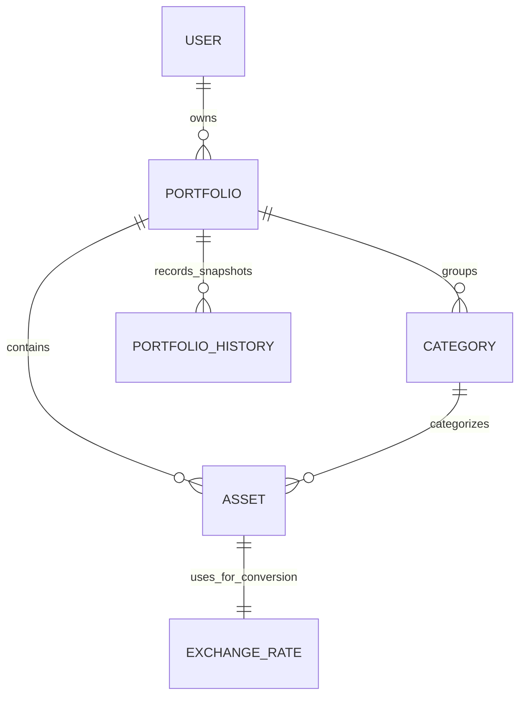

# Data Model: Asset Management System

## Entity Relationships

## Entity Definitions

### User
**Description**: Represents a system user with preferences and settings

**Fields**:
- `id` (string, primary key): Unique identifier for the user
- `email` (string): User's email address
- `language_preference` (string): User's preferred language ('zh' or 'en')
- `theme_settings` (string): Theme preference ('light', 'dark', or 'auto')
- `display_currency` (string): Preferred display currency code (e.g., 'USD', 'EUR', 'CNY')
- `created_at` (timestamp): Account creation timestamp
- `updated_at` (timestamp): Last update timestamp

**Validation Rules**:
- Email must be a valid email format
- Language preference must be one of the supported languages
- Display currency must be one of the available currency codes

### Asset
**Description**: Represents an asset position (not transactions)

**Fields**:
- `id` (string, primary key): Unique identifier for the asset
- `user_id` (string, foreign key): Reference to the owning user
- `portfolio_id` (string, foreign key): Reference to the portfolio containing this asset
- `symbol` (string): Asset symbol (e.g., AAPL, 000001.SZ)
- `name` (string): Full name of the asset
- `quantity` (decimal): Number of shares/units held
- `cost_basis` (decimal): Average cost basis per share/unit (broker-provided)
- `daily_profit` (decimal): Daily profit/loss for this asset (broker-provided)
- `current_price` (decimal): Current market price per share/unit
- `currency` (string): Currency code for this asset (e.g., USD, CNY)
- `broker_source` (string): Source broker identifier
- `category_id` (string, foreign key): Reference to the category this asset belongs to
- `created_at` (timestamp): Asset record creation timestamp
- `updated_at` (timestamp): Last update timestamp

**Validation Rules**:
- Quantity must be positive
- Cost basis must be non-negative
- Current price must be non-negative
- Currency must be a valid ISO currency code
- Symbol and name must not be empty

### Category
**Description**: Represents a grouping of assets with allocation targets

**Fields**:
- `id` (string, primary key): Unique identifier for the category
- `user_id` (string, foreign key): Reference to the owning user
- `name` (string): Category name (e.g., US Equities, Bonds)
- `target_allocation` (decimal): Target allocation percentage (0.00 to 100.00)
- `current_allocation` (decimal): Current allocation percentage (calculated)
- `created_at` (timestamp): Category creation timestamp
- `updated_at` (timestamp): Last update timestamp

**Validation Rules**:
- Name must not be empty
- Target allocation must be between 0.00 and 100.00
- All categories for a user should sum to approximately 100% (with tolerance for rounding)

### Portfolio
**Description**: Represents a user's collection of assets and categories

**Fields**:
- `id` (string, primary key): Unique identifier for the portfolio
- `user_id` (string, foreign key): Reference to the owning user
- `name` (string): Portfolio name
- `description` (string, nullable): Optional description of the portfolio
- `total_value_cny` (decimal): Total value in CNY (calculated)
- `daily_profit_cny` (decimal): Daily profit in CNY (calculated)
- `current_total_profit_cny` (decimal): Cumulative profit in CNY (calculated)
- `created_at` (timestamp): Portfolio creation timestamp
- `updated_at` (timestamp): Last update timestamp

**Validation Rules**:
- Name must not be empty
- All monetary values must be non-negative

### PortfolioHistory
**Description**: Contains authoritative snapshots of portfolio state

**Fields**:
- `id` (string, primary key): Unique identifier for the history record
- `portfolio_id` (string, foreign key): Reference to the portfolio
- `timestamp` (timestamp): UTC timestamp of the snapshot
- `total_value_cny` (decimal): Total portfolio value in CNY at this time
- `daily_profit_cny` (decimal): Daily profit in CNY for this day
- `current_total_profit_cny` (decimal): Cumulative profit in CNY at this time

**Validation Rules**:
- Timestamp must be in UTC
- All monetary values must be non-negative
- Timestamp should be unique for a given portfolio

### ExchangeRate
**Description**: Contains immutable daily FX facts quoted to CNY

**Fields**:
- `id` (string, primary key): Unique identifier for the exchange rate
- `source_currency` (string): Source currency code (e.g., USD, EUR)
- `target_currency` (string): Target currency code (always CNY for this system)
- `exchange_rate` (decimal): Rate from source to target currency (e.g., USD to CNY)
- `date` (date): Date of the exchange rate
- `created_at` (timestamp): Record creation timestamp

**Validation Rules**:
- Source currency must be a valid ISO currency code
- Target currency must be CNY
- Exchange rate must be positive
- Date should be unique for a given source currency

## Indexes

### User Table
- Index on `email` for authentication lookups

### Asset Table
- Index on `user_id` for user-specific queries
- Index on `portfolio_id` for portfolio-specific queries
- Index on `category_id` for category-specific queries
- Index on `symbol` for symbol-based lookups

### Category Table
- Index on `user_id` for user-specific queries

### Portfolio Table
- Index on `user_id` for user-specific queries

### PortfolioHistory Table
- Index on `portfolio_id` for portfolio-specific queries
- Index on `timestamp` for chronological queries

### ExchangeRate Table
- Index on `source_currency` for currency-specific queries
- Index on `date` for date-specific queries
- Unique composite index on `source_currency` and `date`

## Constraints

1. **Referential Integrity**: Foreign key constraints enforce relationships between entities
2. **Data Consistency**: Monetary values stored with 4 decimal places precision as required
3. **Immutability**: ExchangeRate records are immutable once created
4. **Single Source of Truth**: Financial facts stored in CNY only; conversions computed on demand
5. **Temporal Consistency**: All timestamps stored in UTC as required by specifications